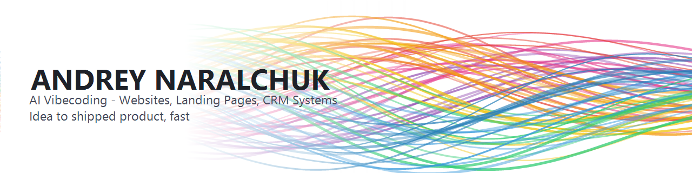
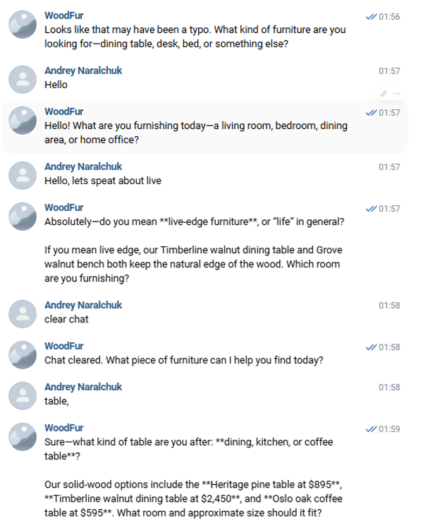

  

<h1 align="center">Andrey Naralchuk</h1>

  <b>AI Vibecoding — from websites and landing pages to full CRM systems</b>

  
  
  
  

---

## About

I build real, working software by talking to AI as a part of typing by
hand. Architecture of software is the core part for me. AI generates routine that is how project is ready for testing fastly. Working software in days, not months.

- **Now:** building websites, landing pages, and CRM systems for small and
  medium businesses, end to end, with AI-assisted development.
- **Background:**  
  5 years in Financial Department (Software Development for Account Department)  
  16 years in enterprise software (PLM/Teamcenter, server and
  client development, DevOps). That discipline is what keeps AI-written code
  production-ready, not just demo-ready.

- **Learning:** new AI coding agents and frameworks, as soon as they are
  useful in real projects.

> **Why this matters to a client:** AI makes the first draft fast. Twenty
> years of engineering experience makes sure that draft is correct, secure,
> and safe to put in front of real users — not just something that looks
> good in a demo.

---

## What I build

### Websites & landing pages
- Business websites, portfolio sites, landing pages for ad campaigns.
- Fast turnaround: a working draft in 1 day, a full site in a few days.
- Responsive, fast-loading, built to handle real traffic — not a mockup.

### CRM & internal systems
- Custom CRM systems built around how a specific team actually works,
  instead of forcing the team into a generic off-the-shelf tool.
- Internal dashboards, admin panels, reporting and workflow tools.
- Integrations: contact forms, e-mail, Telegram/WhatsApp, payment providers.

### Automation & AI integrations
- Chatbots for websites and messengers.
- Workflow automation between existing tools (no-code plus code, where
  code is the faster or more reliable path).
- AI-assisted content generation and data processing.

### MVPs & prototypes
- Turn an idea into a clickable, working prototype in days.
- Validate the idea with real users before investing in a full build.

---

## How I work — vibecoding, in practice

| Step | What happens | Typical time |
|---|---|---|
| 1. Brief | 15–30 minutes: what the product must do, and for whom | same day |
| 2. Draft | First working version, built with AI and hand coding | 1-2 day |
| 3. Review | Every screen and every line checked by hand before it ships | ongoing |
| 4. Iterate | 2–3 rounds of fast changes, based on real feedback | 1–2 days |
| 5. Ship | Deployed, documented, handed over with a short walkthrough | same day |

AI writes the first draft fast. A human — me — decides what is correct, what
is secure, and what is good enough to put in front of real users.

---

## Tech & AI stack

**AI-assisted development**

**Languages**

**Frontend & product**

**Cloud, DevOps, CI/CD**

**Databases**

**Tools and platforms**

---

## Selected projects

| Project | What it does | Built with | Link |
|---|---|---|---|
| WoodFur | Landing page for a solid-wood furniture brand, with an order/contact form | HTML/CSS/JS + Google Apps Script | https://woodfurnitur.netlify.app |
| Building Tracker with GoogleMAP| Interactive map app: draw a zone, see under-construction real-estate objects nearby — developer, address, progress %, completion date, update history | Vite, vanilla JS, Leaflet (draw + marker clustering) | https://and5-construction-tracker.netlify.app/ |
| Sport2Sales | Lead-capture landing page for athlete/sports sales, form submits straight to Google Sheets | HTML/JS + Google Apps Script | https://athletessales.netlify.app/ |
| AI Sales Chatbot | AI chat assistant for the WoodFur store — answers furniture questions, recommends products with prices, keeps context across the conversation | vibecoding, AI stack |  |

_Live link for the AI Sales Chatbot to be added._

---

## Certifications & education

| Certification | Area |
|---|---|
| DevOps | CI/CD and automation |
| Microsoft AZ-900 — Azure Fundamentals | Cloud |
| SLC Teamcenter — Teamcenter X Associate | Siemens PLM |
| Siemens Partner — Insights Hub Associate | Industrial IoT / analytics |

**Education:** Master of Science in Information Technology.

---

## Contact

This README is a draft, stored separately in `markdown/` for review. It
is not the published GitHub profile README yet.
